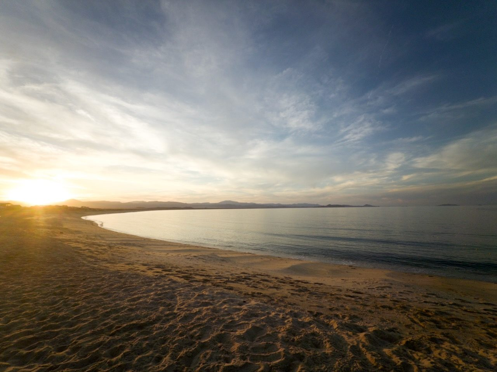
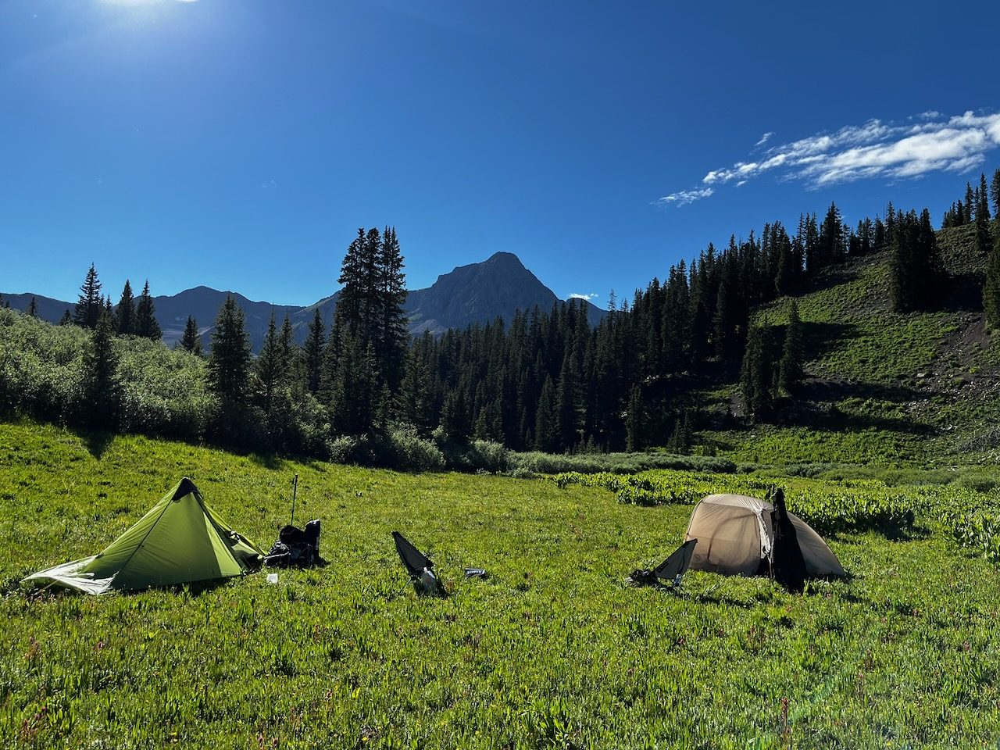

We crossed the border this morning and made our way south along the coast.

<!--more-->

Here is a photo of the bikes settled for the evening:

If you want an automatic image gallery, you can also use Hugo's shortcode:

